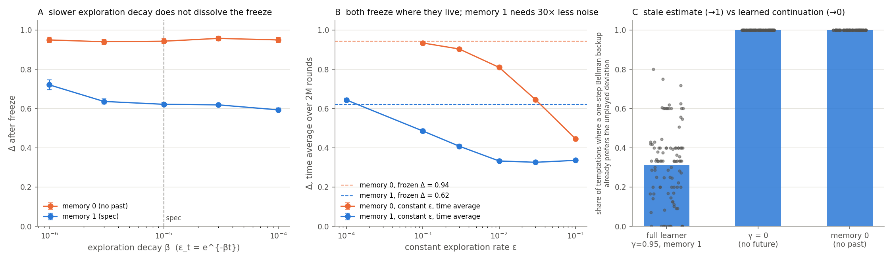

# Phase 1 — strategy or frozen learning?

Follow-up to [RESULTS.md](RESULTS.md). That report ended with a puzzle: the memory-0 learner,
which cannot condition on the past and therefore cannot punish, reaches Δ = 0.95, higher than the
full learner (0.62), and the three behavioural indicators fire for it anyway. RESULTS.md guessed
"stale estimates plus vanishing exploration". Phase 1 tests that guess. Everything here is
`python phase1.py <command>`, 100 seeds per cell, same hyperparameters as the spec unless the cell
changes exactly one of them.

## Predictions, written before running

| # | experiment | prediction | held? |
|---|---|---|---|
| 1 | β sweep: slower exploration decay | memory-0 Δ falls toward 0 as decay slows; memory-1 holds | **no** |
| 2 | ε re-injection from converged tables | memory-1 re-converges to the same Δ; memory-0 collapses | **half**: memory-1 yes, memory-0 also re-converges |
| 3 | Bellman residual on the temptation action | memory-0 residual large (stale); memory-1 residual small (learned) | **yes**, with a twist |
| 4 | pay-as-bid | the (low, high, high) rest point vanishes, memory-0 Δ falls a lot | **no**: Δ falls 0.10, rest point moves, freeze stays |
| 5 | constant ε occupation measure | frozen Δ = lim ε→0 of the time-average Δ | **yes**, for both learners; memory-1 needs 30× less noise |

Two of five predictions failed. The failures are the useful part: they rule out "stale table by
accident" and "an artefact of one auction rule", and leave one explanation standing.

## 1. β sweep — exploration length is not the cause

ε_t = e^{-βt}. Horizon = 10/β + 4M rounds so every cell reaches the same ε and gets the same
post-exploration tail. β = 1e-6 gives ten times as many exploratory rounds as the spec.

| β | rounds | memory 0 Δ (95% CI) | memory 1 Δ (95% CI) | memory 1 converged |
|---|---|---|---|---|
| 1e-6 | 14M | 0.949 (0.936–0.962) | **0.721** (0.695–0.746) | 88% |
| 3e-6 | 7.3M | 0.940 (0.928–0.952) | 0.636 (0.623–0.649) | 100% |
| 1e-5 (spec) | 5M | 0.943 (0.931–0.954) | 0.621 (0.612–0.630) | 100% |
| 3e-5 | 4.3M | 0.957 (0.946–0.968) | 0.618 (0.610–0.626) | 100% |
| 1e-4 | 4.1M | 0.949 (0.938–0.961) | 0.593 (0.583–0.603) | 100% |

Memory-0 is flat at 0.95 across two orders of magnitude of β. If the freeze were "ε died before
the undercutting race finished", a ten-fold longer race would have finished. It did not. Memory-1
moves the other way: slower decay gives *higher* prices (0.59 → 0.72), the direction Calvano et al.
report for pricing games.

## 2. ε re-injection — the freeze is an attractor, not an accident

Load each converged 5M table, restart training with ε_t = ε₀·e^{-βt}, 2M rounds, then freeze and
measure Δ again.

| source | ε₀ | Δ before → after | seeds dropping > 0.1 | lowest 1k-round mean price during the run | low-bidder role changed |
|---|---|---|---|---|---|
| memory 1 | 0.05 | 0.621 → 0.622 | 4% | €38 | — |
| memory 1 | 0.5 | 0.621 → 0.621 | 5% | €38 | — |
| memory 0 | 0.05 | 0.943 → 0.945 | 11% | €37 | 71% |
| memory 0 | 0.5 | 0.943 → 0.952 | 10% | €37 | 70% |

ε₀ = 0.5 scrambles the tables: prices fall to about €37 for hundreds of thousands of rounds, and
in 70% of the memory-0 seeds a *different* firm ends up as the low bidder. The system still
returns to (low, high, high) at €87–100. A stale-table accident would not survive that. Something
in the dynamic pulls the process back to the top whenever exploration fades.

Memory-1 also re-converges to its old Δ. Whatever the two learners are doing, both are doing it
robustly.

## 3. Bellman residual — the one number that separates the two learners

At every state on the converged cycle and for every agent with a profitable unplayed deviation
a_dev: target = r(a_dev, rivals at their greedy action) + γ·max Q[s′], residual = target − Q[s, a_dev].
Residual ≈ 0 means the table has *learned* what a deviation is worth and still declines it, because
the continuation after deviating is poor. Residual ≫ 0 with target > Q[s, a_played] means nobody has
tried a_dev since the rivals settled: the low estimate is inherited from the exploration era.

| configuration | residual on played action | residual on a_dev | share of temptations where the one-step backup already prefers a_dev | seeds at 0% / 100% |
|---|---|---|---|---|
| full learner (memory 1, γ 0.95) | 0 | €2,708 | **31%** | 12 / 0 |
| γ = 0 | 0 | €865 | 100% | 0 / 95 |
| memory 0 | 0 | €6,656 | 100% | 0 / 100 |

Played actions are exactly Bellman-consistent everywhere, as they must be. The deviation estimates
are stale in every configuration, but the consequence differs. For γ = 0 and memory-0 a single
backup already flips the decision in 100% of temptations, in every seed: the learner is sitting on
money it has not looked at. For the full learner a backup flips the decision in 31% of temptations;
in the other 69% the value of the state *reached by deviating* is low enough that the deviation
stays unattractive even with a fresh estimate. That is a learned continuation, the thing tacit
collusion consists of. Twelve seeds are at 0% (pure learned continuation), none at 100%, the
highest single seed is 80%.

This is the candidate discriminating indicator. It uses the Q-table, not behaviour, so it cannot be
applied to a real market, but as a test of what a simulated learner has learned it does what the
M3–M5 battery could not: memory-0 and γ = 0 sit at 1.0 in every seed, the full learner sits at
0.31 with a distribution that does not overlap.

## 4. Pay-as-bid — the freeze is not a property of the uniform-price rule

Same learners, same grid, dispatched firms paid their own bid instead of the marginal one.

| configuration | Δ (95% CI) | most common frozen profiles |
|---|---|---|
| memory 0, pay-as-bid | 0.845 (0.819–0.871) | (68,68,68) ×16, (94,94,94) ×12, (81,81,81) ×9, (87,87,87) ×8 |
| memory 1, pay-as-bid | 0.689 (0.677–0.701) | (55,55,55) ×13, (49,49,55) ×9, (61,61,61) ×8, (49,49,49) ×8 |

The prediction was that (low, high, high) would stop being a rest point because the low bidder is
no longer paid the high price. It did stop: memory-0 now freezes at a symmetric tie, each firm
selling a third at its own bid. But it freezes all the same, at Δ 0.85, with every firm able to gain
about €1,800 per round by shaving one rung. The auction rule changes *where* the process stops, not
*whether* it stops.

## 5. Occupation measure — what the freeze actually is, and why memory-1 is different

Constant ε (β = 0), 3M rounds, statistics on the last 2M, 100 seeds per point. Same learners as
the spec, one at a time.

| ε | memory 0: time-average Δ (95% CI) | blocks > €55 | memory 1: time-average Δ (95% CI) | blocks > €55 |
|---|---|---|---|---|
| 0.1 | 0.446 (0.446–0.446) | 28% | 0.336 (0.336–0.336) | 0% |
| 0.03 | 0.645 (0.645–0.645) | 62% | 0.326 (0.325–0.326) | 0% |
| 0.01 | 0.810 (0.809–0.810) | 84% | 0.333 (0.329–0.336) | 4% |
| 0.003 | 0.903 (0.902–0.905) | 95% | 0.408 (0.401–0.415) | 24% |
| 0.001 | 0.934 (0.931–0.937) | 98% | 0.486 (0.477–0.494) | 48% |
| 0.0001 (30M rounds) | — | | 0.643 (0.635–0.652) | 94% |
| → 0 (frozen, §1) | **0.943** | | **0.621** | |

**Memory 0.** The time-average Δ rises monotonically as ε falls and reaches 0.934 at ε = 0.001,
within 0.01 of the frozen value. The frozen price is the ε → 0 limit of where the exploring process
spends its time. Under exploration the memory-0 learners run an Edgeworth cycle: an undercut is
discovered, the undercut firm loses its volume and undercuts back, the price walks down the grid,
and near the bottom raising a bid costs nothing because there is nothing to lose, so the price
jumps back up. The walk down is a chain of learning events, each needing a specific exploratory
draw at a specific time; the jump up is one event. The cycle lives near the top, more so the less
exploration there is, and freezing samples that distribution. This is a statement about a learning
dynamic, not about strategy. It is close in spirit to stochastic stability (Kandori, Mailath & Rob
1993; Young 1993): the states selected as noise vanishes are the ones with the largest basins under
the noisy dynamic, and here those are the high-price profiles. It has nothing to do with the folk
theorem.

**Memory 1.** The exploring process lives at Δ 0.33–0.49 for ε between 0.1 and 0.001, *below*
its frozen 0.62, with 0% of blocks above €55 for ε ≥ 0.03. Only at ε = 1e-4, with a 30M-round
run, does the time average reach 0.64 and meet the frozen value. So the memory-1 price is also a
small-noise limit of its occupation measure, but a far more fragile one: memory-0 is within 5% of
its frozen price at ε = 0.003, memory-1 needs thirty times less noise. That is what a coordinated
cycle looks like: three agents alternating between a high and a low profile, which any single
random draw breaks for a stretch, and which is re-established only when draws are rare. The
occupation measure does not separate the two learners by kind, only by noise tolerance; the
Bellman residual in §3 remains the qualitative separator.

## What this changes in the RESULTS.md verdict

- The memory-0 price is now explained, not just described. It is the small-noise limit of an
  Edgeworth cycle run by ε-greedy learners on a discrete grid. It survives slower decay, strong
  perturbation, and a change of auction rule. It is not collusion and it is not an accident.
- The full learner is doing something the memory-0 learner is not. Two independent measurements
  say so: its deviation estimates are also stale, but in 69% of temptations the continuation
  value after deviating is low enough that a fresh estimate would not change the decision (§3);
  and its high price collapses under exploration noise that leaves the memory-0 price untouched
  (§5): memory-0 holds 0.90 at ε = 0.003, memory-1 holds 0.41 there and needs ε = 1e-4 to reach
  its frozen 0.62. The twelve seeds at 0% in §3 are,
  by that measure, pure learned continuation. Whether "learned continuation" deserves the name tacit collusion is a
  question about definitions; the measurement is not ambiguous.
- The M4 verdict in RESULTS.md stands: Δ alone cannot tell these two learners apart, and the spec's
  ablation was right to fail. The Bellman residual can tell them apart. That is the result to build
  Phase 2 around.

## Open

- The residual uses a one-step backup with the current table; Q[s′] may itself be stale. A k-step
  rollout under the greedy policy would be stricter. Not done.
- The memory-1 occupation curve meets its frozen value at ε = 1e-4 (30M rounds, 100 seeds). One
  point; a 3e-4 point would pin down where the transition sits.
- No theory. The Edgeworth-cycle argument is verbal. A two-firm, three-price version might be
  solvable by hand.
