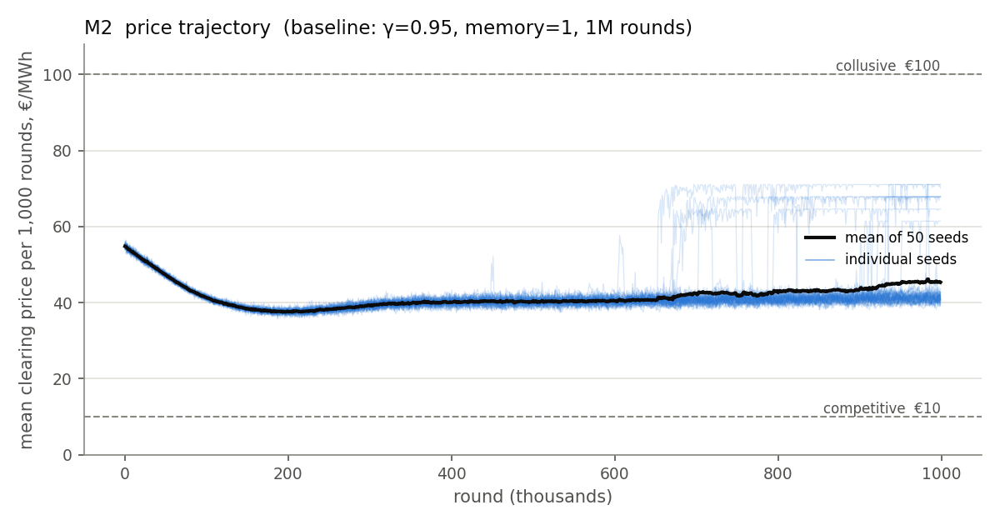
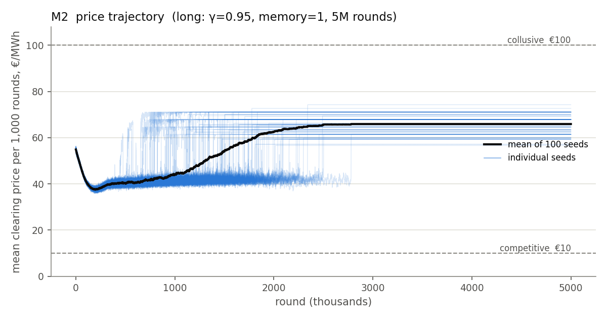
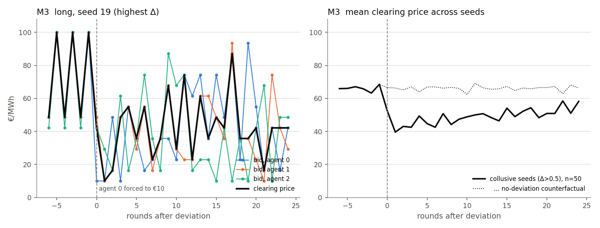
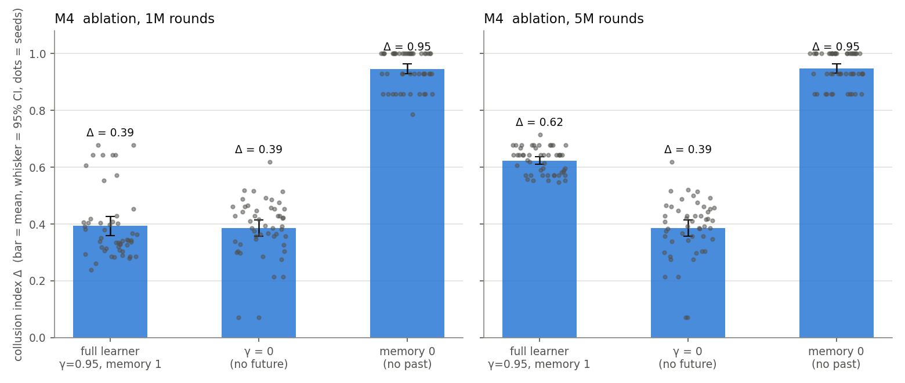

# Results

> Follow-up: [PHASE1.md](PHASE1.md) explains the memory-0 puzzle below and adds a Q-table indicator that separates the two learners.

Three independent tabular Q-learners, uniform-price auction, single node, parameters exactly
as in [SPEC.md](SPEC.md). 50 seeds per configuration, hyperparameters fixed before any
result was seen and never tuned. Everything below is reproducible with
`python experiments.py && python indicators.py` (about 5 minutes).

## Verdict in one paragraph

The learners reach supra-competitive prices: once converged, every seed sits at
**Δ ≈ 0.62** (95% CI 0.61 to 0.64), and when one agent is forced to undercut, its rivals
lower their own bids in 88% of seeds, though they return to the old level within 24 rounds
in only 24%. But the shortsightedness ablation **fails**: agents with no
memory of the past reach *higher* prices (Δ 0.95), and agents that do not value the future
still reach Δ 0.39. The "unclaimed temptation" fingerprint is present in 100% of seeds, but
it is equally present in the memory-0 control, which cannot anticipate anything. By the
spec's own rules, the high prices cannot be attributed to tacit collusion. This is a
negative result and it is the main finding.

## M2 — collusion index across seeds

Δ is measured on frozen greedy play after training (1,000 rounds, first 100 dropped), not
on the training trace. CI is mean ± 1.96 × standard error across seeds.

| configuration | rounds | Δ mean | 95% CI | median | seeds with Δ > 0.5 | converged |
|---|---|---|---|---|---|---|
| **baseline** γ=0.95, memory 1 (spec) | 1M | 0.394 | 0.360 – 0.428 | 0.343 | 18% | 0% |
| baseline, longer horizon | 5M | **0.623** | 0.611 – 0.636 | 0.643 | 100% | 100% |
| γ = 0 (no future) | 1M | 0.386 | 0.357 – 0.414 | 0.393 | 8% | 0% |
| γ = 0 (no future) | 5M | 0.386 | 0.357 – 0.414 | 0.401 | 8% | 100% |
| memory 0 (no past) | 1M | 0.946 | 0.928 – 0.963 | 0.964 | 100% | 78% |
| memory 0 (no past) | 5M | 0.947 | 0.931 – 0.963 | 0.929 | 100% | 100% |

"Converged" = no agent's greedy policy changed during the last 100,000 rounds.

**The spec's 1M-round horizon binds.** At 1M rounds no seed has converged and the
distribution is bimodal: 41 seeds between Δ 0.2 and 0.5, 9 seeds between 0.5 and 0.7. In the
5M runs the seeds jump one at a time from a mean price near €40 to €60–72, between roughly
650k and 2.5M rounds, and then never move again; every seed converges (median convergence
round 1.62M) and all 50 land in a narrow band, Δ 0.55 to 0.72. The spec's acceptance
criterion for M2 ("a meaningful fraction of seeds converge to Δ > 0.5") is not met at 1M and
is met at 5M.




**What the converged policies actually do.** They do not sit at a constant high price. 46 of
50 seeds play a short cycle, most often a 2-cycle alternating between a symmetric high
profile (bids €94 to €100) and a symmetric low profile (bids €36 to €42). Mean price ≈ €66,
hence Δ ≈ 0.62. A typical converged seed:

```
round t   bids (100, 94, 100)  ->  price 100
round t+1 bids ( 36, 42,  36)  ->  price  36
round t+2 bids (100, 94, 100)  ->  price 100   ...
```

## M3 — punishment (indicator 1)

Learning frozen, greedy play allowed to settle, then agent 0 forced to bid €10 for one round,
then 24 rounds of greedy play. Judged on the **rivals' bids** (the deviator's own later
choices must not count as retaliation) against a counterfactual path with no deviation (so a
converged cycle is not mistaken for a drop), in two 12-round windows. *Punish-forgive* =
rivals bid at least half a rung lower than the counterfactual in rounds 1–12 and are back
within half a rung in rounds 13–24; *punish, no recovery* = lower and still lower;
*no reaction* = rivals' bids do not move.

| configuration | seeds tested | punish-forgive | punish, no recovery | no reaction |
|---|---|---|---|---|
| baseline 1M, collusive seeds only (Δ > 0.5) | 9 | 33% | 56% | 11% |
| baseline 5M, all seeds (all collusive) | 50 | **24%** | **64%** | 12% |
| γ = 0, collusive seeds | 4 | 0–25% | 25% | 50–75% |
| memory 0, all seeds (control) | 50 | 0% | 0% | **100%** |



**Reading.** A deviation is answered. In the converged 5M runs the rivals' bids over the
next twelve rounds average €16 below what they would otherwise have been, and the clearing
price falls from €66 to €46. What happens next splits the seeds: in 24% the rivals are back
at their old bids by rounds 13–24 (price €62 against a counterfactual €65), which is the
punish-then-forgive pattern; in 64% they are still bidding €19 lower (price €46 against
€67), a grim trigger or simply no learned route back to the cycle; in 12% the rivals never
moved. Letting agent 1 or agent 2 be the deviator gives the same split (22% and 20%
forgive), but the verdict for a *given* seed changes with the deviator in 32 of 50 seeds,
so the response is not one shared strategy.

The memory-0 control behaves exactly as it must: with no state there is nothing to react to,
and 100% of seeds show no reaction. The test therefore does discriminate, and the memory-1
learners pass its weaker form (rivals react) in 88% of seeds and its full form (react, then
forgive) in a quarter.

The one-round deviation itself is *profitable* in this market: the deviator sells 60 MW at
the rivals' price instead of a one-third share (see M5), and the clearing price does not move
in the deviation round because it is set by the second-lowest bid.

## M4 — shortsightedness ablation (indicator 2)

Collapse criterion, fixed in advance: ablated Δ below 0.25 **and** below half the
full learner's Δ.

| horizon | full learner | γ = 0 | memory 0 | verdict |
|---|---|---|---|---|
| 1M | 0.394 | 0.386 (not collapsed) | 0.946 (not collapsed) | **fail** |
| 5M | 0.623 | 0.386 (not collapsed) | 0.947 (not collapsed) | **fail** |



**Reading.** High prices survive both ablations; the spec is explicit that this means they
had some other cause and the M2 result is not collusion.

- **γ = 0.** A fully myopic learner still ends at Δ 0.39, and at the spec's 1M horizon it is
  statistically indistinguishable from the full learner. Its converged play is long,
  irregular cycles (half the seeds cycle with period ≥ 8). Removing the future removes about
  40% of the converged price premium, not all of it.
- **Memory 0.** With a single state the learners freeze, in every seed, at an asymmetric
  fixed point: one firm low, two firms high, for example bids (29, 100, 100) or
  (23, 87, 87). The clearing price is the second-lowest bid, so it is the *high* price; the
  low bidder sells 60 MW at it and earns the most. Each of the two high bidders could gain
  by undercutting the other (40 MW at ~€94 ≈ €3,300 versus 20 MW at €100 = €1,800), but the
  estimate it holds for that action dates from the exploration phase, when rivals bid at
  random, and ε has decayed far below one exploration per million rounds. The Bertrand race
  needs two active undercutters and never gets its second one. Stale estimates plus vanishing
  exploration, not strategy, produce Δ 0.95.

The two learners reach high prices by different mechanisms, and the ablation compares only
Δ, so it cannot tell them apart. That is a limitation of the indicator in this market, not a
reason to soften the verdict.

## M5 — unclaimed temptation (indicator 3)

At every state on the converged cycle, each agent's best one-shot deviation profit minus its
realised profit, rivals held fixed.

| configuration | seeds with a profitable, unplayed deviation | mean best gap, €/round |
|---|---|---|
| baseline 1M, collusive seeds | 100% | 2,443 |
| baseline 5M | 100% | 2,199 |
| γ = 0 | 96% | 1,221 |
| memory 0 (control) | **100%** | 1,453 |

**Reading.** On the high round of the cycle every agent earns €3,000 (one third of 100 MW at
€100 margin €90) and could earn €5,400 by shaving one rung off its bid: the price would not
move and it would sell its full 60 MW. Nobody does. That is the textbook fingerprint of
anticipated retaliation, and in the memory-1 learners it is consistent with the M3 result.
But the memory-0 control leaves the same kind of money on the table in 100% of seeds while
being structurally incapable of anticipating anything. **In this market the fingerprint is
produced by frozen learning just as readily as by strategy, so it is not evidence on its own.**

## Summary of verdicts

| | test | spec's acceptance | outcome |
|---|---|---|---|
| M2 | Δ > 0.5 in a meaningful fraction of seeds | 1M: 18%, none converged · 5M: 100%, all converged | met only at 5M |
| M3 | punish, then forgive | rivals react in 88% of converged seeds; forgive within 24 rounds in 24% | partial: punished, rarely forgiven |
| M4 | Δ collapses under γ = 0 and memory 0 | 0.39 and 0.95 versus 0.62 | **fail** |
| M5 | profitable deviation exists and is unplayed | 100%, but also 100% in the memory-0 control | present, not discriminating |

**Conclusion.** Independent Q-learners in this uniform-price auction do reach and sustain
supra-competitive prices, and a deviation does trigger lower rival bids in most seeds. But
neither memory nor foresight is necessary for high prices here, and the indicator meant to
expose anticipated retaliation fires equally for a learner that has no such capacity. The
honest statement is: *agents converged to supra-competitive prices under these parameters,
and the evidence does not support calling it tacit collusion.*

## Why this market behaves this way

Three firms of 60 MW facing 100 MW of demand means the clearing price is always the
**second-lowest** bid. A single undercutter is rewarded with volume at an unchanged price;
the price only falls when a second firm follows. That has two consequences that drive
everything above: a lone deviation is profitable and painless for the price, so the
"temptation" in M5 is enormous (€2,400 per round) and unavoidable; and the competitive race
stalls whenever one of the two firms needed to run it stops exploring, which is what
happens to every memory-0 learner and to some extent to every learner once ε has decayed.

## Not done, and limits

- Congestion, the seven-bus network, and multi-segment bid curves from the paper are not
  implemented (phase two in the spec).
- Hyperparameters (α 0.15, γ 0.95, β 1e-5, 15-rung grid) were taken from the spec and not
  swept. The only extra configuration is the 5M-round horizon, reported in full. Whether a
  slower exploration decay dissolves the memory-0 freeze is an open question and the obvious
  next experiment.
- The punishment verdict uses fixed windows and thresholds (rivals' mean bid at least half a
  rung below the counterfactual in rounds 1–12; back within half a rung in rounds 13–24).
  Twelve-round windows absorb phase shifts of cycles of length 1–4 and 6; the 5 seeds with
  5- or 7-cycles can be misread. Per-seed bid and price paths are in
  `results/indicators_<config>.json` for anyone who wants different rules.
- Everything the paper's limits imply carries over: simulation only, one stylised market,
  indicators defined by the authors, no external replication.
